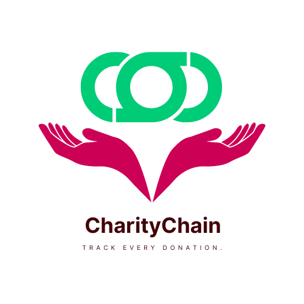

# CharityChain



## Table of Contents
- [Introduction](#introduction)
- [Features](#features)
- [How It Works](#how-it-works)
- [Technology Stack](#technology-stack)
- [Why Blockchain?](#why-blockchain)
- [Setup and Installation](#setup-and-installation)
- [Future Enhancements](#future-enhancements)
- [Team](#team)

## Introduction

**CharityChain** is a blockchain-based crowdfunding platform designed to enhance transparency and reliability in the donation process. Our mission is to revolutionize the way charities and donors interact by utilizing blockchain technology to ensure that every donation is traceable and secure.

The project is built as part of *AsianHack 2024* to address the growing concerns of mismanagement, lack of transparency, and trust issues in the charitable donation space.

## Features

- **Transparency:** Every transaction is recorded on the blockchain, making the donation process fully auditable.
- **Trust:** Donors can track their contributions in real-time, ensuring that their funds are being used for the intended cause.
- **Decentralized:** No central authority manages the funds; the process is handled via smart contracts, ensuring trust and reducing intermediaries.
- **Security:** All transactions and data are secured using blockchain encryption standards.
- **Global Access:** Donors and charities from around the world can participate without worrying about geographical restrictions or intermediaries.

## How It Works

1. **Sign Up and Authentication:** Users sign up on the platform as either donors or organizations.
2. **Create a Campaign:** Organizations can create charity campaigns specifying their goals and required funds.
3. **Donation Process:** Donors browse through verified charity campaigns and contribute directly through the blockchain.
4. **Smart Contracts:** Every donation triggers a smart contract that automatically records the transaction, ensuring that funds are distributed once certain conditions are met.
5. **Tracking Donations:** Donors can track where their funds go and how they are utilized through real-time dashboards, powered by blockchain's immutability.
6. **Completion:** Once the campaign's goal is met, the funds are transferred to the charity in a transparent and accountable manner.

## Technology Stack

- **Blockchain:** Ethereum
- **Smart Contracts:** Solidity
- **Frontend:** React.js

## Why Blockchain?

By using blockchain technology, *CharityChain* solves the problem of trust between donors and organizations. All transactions are visible on the blockchain, ensuring transparency, while smart contracts guarantee that the funds are used appropriately, reducing the possibility of fraud or misuse.

## Setup and Installation

To set up the project locally:

1. Clone the repository:
   ```bash
   git clone https://github.com/basnetmohan2030/Project-CharityChain/
   ```

2. Navigate to the project directory:
   ```bash
   cd Project-CharityChain
   ```

3. Install dependencies:
   ```bash
   npm install
   ```

4. Configure environment variables in `.env` file:
   - Blockchain API Key
   
5. Start the development server:
   ```bash
   npm run dev
   ```

6. For smart contract deployment, use:
   ```bash
   truffle migrate
   ```

## Future Enhancements

- Integration with more blockchain networks like Binance Smart Chain.
- Add support for recurring donations and subscription-based charity models.
- Multilingual support for global accessibility.
- AI-driven fraud detection to monitor charity campaigns.
- Mobile app for seamless user experience.

## Team

- **Mohan Basnet**
- **Binayak Kunwor**